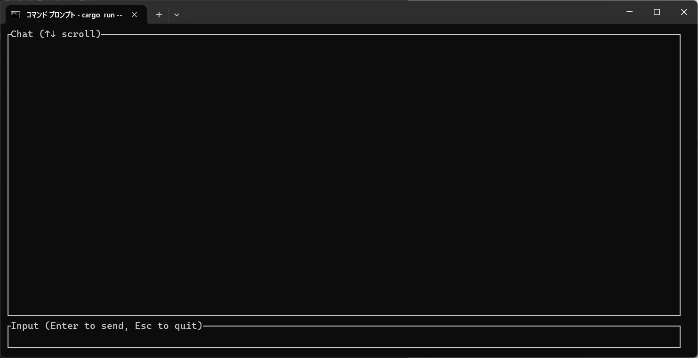

# Gemini Terminal Chat

Geminiとお話ができます。
使用するモデルは`Gemini-2.5-flash`です。

## 設定方法

1. プロジェクトルートに.envを設置し、`GEMINI_API_KEY=`に続く形であなたのGemini API Keyを記述してください。

2. `cargo run --release`で実行してください。
3. 以下のような画面が出てきます。

4. Geminiと会話をしましょう！

---

# 使い方

| キー | 動作 |
| --- | ----- |
| Enter | 送信 |
| Up, Down | (上/下)にスクロール |
| Esc | ターミナルに戻る |
| 上記以外の任意のキー | 入力されます |
